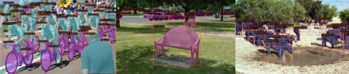

**My Project Plan (Level 1 Heading)**

***Note:*** This document is written merely as an illustrative example, and does not provide any working guide to an actual project.

**Proposal (Level 3 Heading)**

I am planning to make a computer vision software that detects objects in images.

In order to build it, I will use opencv, deep learning libraries, such as [TensorFlow ](https://www.tensorflow.org/)or [PyTorch](https://pytorch.org/), and other open source softwares.

For example, the objects in the following images were detected using [mmdetection](https://github.com/open-mmlab/mmdetection): 

**Dependencies (Level 3 Heading)**

- python
- opencv-python
- tensorflow
- openmmlab
- package manager

**Installation**

In a bash terminal, run the following commands (*Do NOT actually run these commands in your computer*):

$ sudo apt update 

$ conda create -n cv\_detection $ conda activate cv\_detection $ python --version 

$ python example.py
